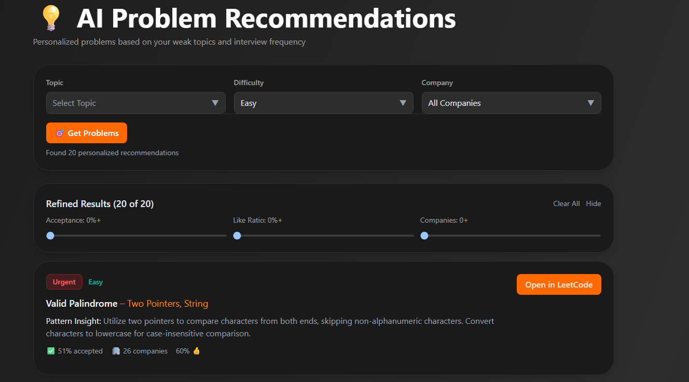
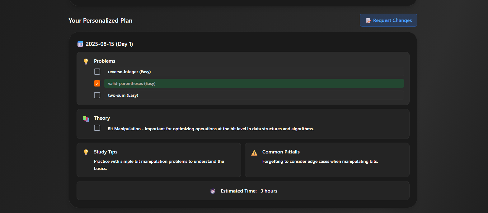
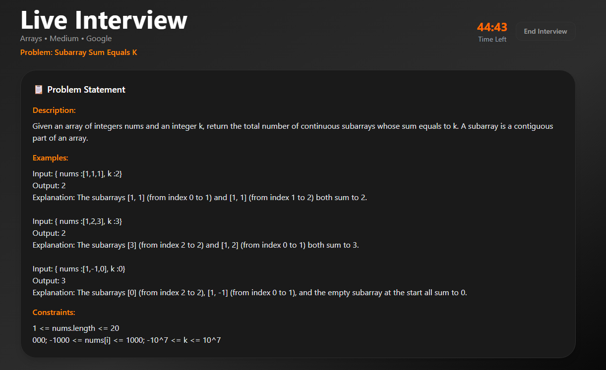
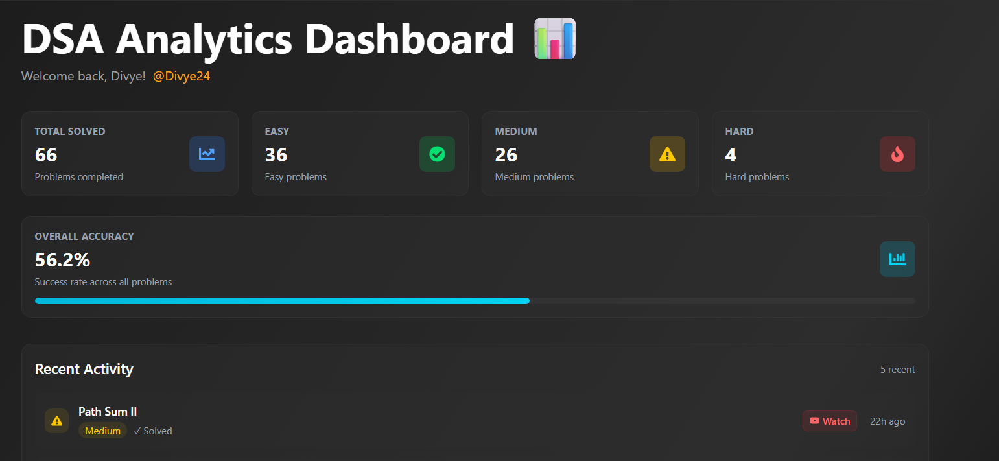

# 🚀 D0DSA - AI-Powered Data Structures & Algorithms Study Platform

<div align="center">

<div align="center">
  
  <br><br>
  <a href="https://dodsa-five.vercel.app/">
    
  </a>
  <a href="[your-extension-link](https://chromewebstore.google.com/detail/dsa-prep-leetcode-sync/fdljbdkjhcbnnlpcdbfleibfkkgpjckf?authuser=0&hl=en)">
    
  </a>
</div>

_Revolutionize your coding interview preparation with AI-driven personalized study plans_

</div>

## 🎯 Overview

D0DSA is a comprehensive, AI-powered platform designed to optimize your data structures and algorithms preparation. Using advanced OpenAI integration, real-time LeetCode synchronization, and personalized learning paths, it transforms the way developers prepare for technical interviews.

## ✨ Key Features

### 🧠 AI-Powered Intelligence

- **Smart Problem Recommendations** - AI analyzes your weak topics and suggests personalized problems
- **Pattern Recognition Insights** - Get crucial solving hints and algorithmic patterns for each problem
- **Dynamic Study Plans** - AI generates multi-day prep schedules tailored to your target company
- **Mock Interview Simulator** - Practice with AI interviewer providing real-time feedback

### 📊 Real-Time Analytics

- **LeetCode Sync** - Automatic synchronization with your LeetCode progress
- **Interactive Dashboard** - Visual progress tracking with heatmaps and statistics
- **Streak Monitoring** - Gamified progress tracking to maintain consistency
- **Topic Mastery Analysis** - Detailed breakdown of your strengths and weaknesses

### 📚 Advanced Learning Tools

- **Smart Flashcards** - AI-generated flashcards with PDF export functionality
- **Progress Tracking** - Task completion with optimistic updates and real-time sync
- **Company-Specific Prep** - Targeted preparation for Google, Amazon, Microsoft, and more
- **Browser Extension** - Seamless LeetCode integration (Chrome/Firefox)

### 🎨 Modern User Experience

- **Dark Theme UI** - Sleek, eye-friendly interface optimized for long study sessions
- **Responsive Design** - Perfect experience across desktop, tablet, and mobile
- **Page Transitions** - Smooth animations powered by Framer Motion
- **Real-time Updates** - Live progress updates without page refreshes

## 🛠️ Tech Stack

### Frontend

- **React 19** - Latest React with concurrent features
- **Vite** - Lightning-fast build tool and dev server
- **TailwindCSS** - Utility-first CSS framework for rapid UI development
- **Framer Motion** - Smooth animations and page transitions
- **React Query** - Server state management with caching and optimistic updates
- **React Router** - Client-side routing with proper SPA navigation
- **React Hot Toast** - Beautiful toast notifications
- **Zustand** - Lightweight state management

### Backend

- **Node.js & Express** - Robust REST API with middleware support
- **Supabase** - PostgreSQL database with real-time capabilities
- **OpenAI GPT-4** - Advanced AI integration for recommendations and insights
- **PDF Generation** - Server-side PDF creation with PDFKit
- **File Upload** - Multer-powered PDF processing for flashcards
- **CORS Configuration** - Secure cross-origin requests for web and extension

### Infrastructure

- **Vercel** - Frontend deployment with edge functions
- **Render** - Backend hosting with auto-scaling
- **GitHub Actions** - Automated deployment pipeline
- **Browser Extension** - Chrome/Firefox extension for LeetCode integration

## 🚀 Quick Start

### Prerequisites

- Node.js 18+
- npm or yarn
- Supabase account
- OpenAI API key

### Installation

1. **Clone the repository**

   ```bash
   git clone https://github.com/yourusername/dsa-prep.git
   cd dsa-prep
   ```

2. **Setup Backend**

   ```bash
   cd backend
   npm install
   cp .env.example .env
   # Add your Supabase and OpenAI credentials
   npm run dev
   ```

3. **Setup Frontend**

   ```bash
   cd frontend
   npm install
   cp .env.example .env
   # Add your Supabase public credentials
   npm run dev
   ```

4. **Install Browser Extension**
   - Open Chrome/Firefox
   - Go to Extensions → Developer Mode
   - Load Unpacked → Select `extension` folder

### Environment Variables

#### Backend (.env)

```env
SUPABASE_URL=your_supabase_url
SUPABASE_SERVICE_ROLE_KEY=your_service_role_key
OPENAI_API_KEY=your_openai_api_key
NODE_ENV=development
DB_ENCRYPTION_KEY=your_encryption_key
```

#### Frontend (.env)

```env
VITE_SUPABASE_URL=your_supabase_url
VITE_SUPABASE_ANON_KEY=your_anon_key
```

## 📱 Features Showcase

### 🎯 AI Problem Recommendations



Get personalized problem suggestions based on:

- Your weak topics and accuracy rates
- Target company requirements
- Difficulty progression
- Real-time filtering (acceptance rate, company frequency, like ratio)

### 📋 Smart Study Plans



AI-generated multi-day study schedules featuring:

- Company-specific problem selection
- Theory and practice balance
- Progress tracking with task completion
- Modification requests with natural language

### 🎤 Mock Interview Simulator



Practice with AI interviewer:

- Real-time coding challenges
- Interactive Q&A session
- Detailed performance feedback
- Time management training

### 📊 Progress Dashboard



Comprehensive analytics including:

- Submission heatmap visualization
- Topic mastery breakdown
- Streak tracking and statistics
- Recent activity timeline

## 🏗️ Architecture

```
┌─────────────────┐    ┌─────────────────┐    ┌─────────────────┐
│   Frontend      │    │   Backend       │    │   Services      │
│   (Vercel)      │    │   (Render)      │    │                 │
│                 │    │                 │    │                 │
│ • React 19      │◄──►│ • Node.js       │◄──►│ • Supabase      │
│ • TailwindCSS   │    │ • Express       │    │ • OpenAI        │
│ • React Query   │    │ • JWT Auth      │    │ • LeetCode API  │
│ • Framer Motion │    │ • PDF Kit       │    │                 │
└─────────────────┘    └─────────────────┘    └─────────────────┘
         ▲                                              ▲
         │                                              │
┌─────────────────┐                              ┌─────────────────┐
│ Browser Ext     │                              │   Database      │
│                 │                              │   (Supabase)    │
│ • LeetCode Sync │                              │                 │
│ • Auto Import   │                              │ • PostgreSQL    │
│ • Real-time     │                              │ • Row Level     │
└─────────────────┘                              │   Security      │
                                                 └─────────────────┘
```

## 🤝 Contributing

We welcome contributions! Please see our [Contributing Guide](CONTRIBUTING.md) for details.

### Development Workflow

1. Fork the repository
2. Create a feature branch (`git checkout -b feature/amazing-feature`)
3. Commit your changes (`git commit -m 'Add amazing feature'`)
4. Push to the branch (`git push origin feature/amazing-feature`)
5. Open a Pull Request

## 📄 License

This project is licensed under the MIT License - see the [LICENSE](LICENSE) file for details.

## 🙏 Acknowledgments

- **OpenAI** for providing powerful AI capabilities
- **Supabase** for the excellent backend-as-a-service platform
- **LeetCode** for the comprehensive problem database
- **Vercel** for seamless frontend deployment
- **Render** for reliable backend hosting

## 📞 Support

- 📧 Email: support@dsaprep.com
- 💬 Discord: [Join our community](https://discord.gg/dsaprep)
- 🐛 Issues: [GitHub Issues](https://github.com/yourusername/dsa-prep/issues)
- 📖 Docs: [Documentation](https://docs.dsaprep.com)

---

<div align="center">

**⭐ Star this repo if it helped you ace your coding interviews! ⭐**

Made with ❤️ by developers, for developers

[🚀 Try DSA Prep Live](https://dodsa-five.vercel.app) | [📚 Documentation](https://docs.dsaprep.com) | [🤝 Contribute](CONTRIBUTING.md)

</div>
